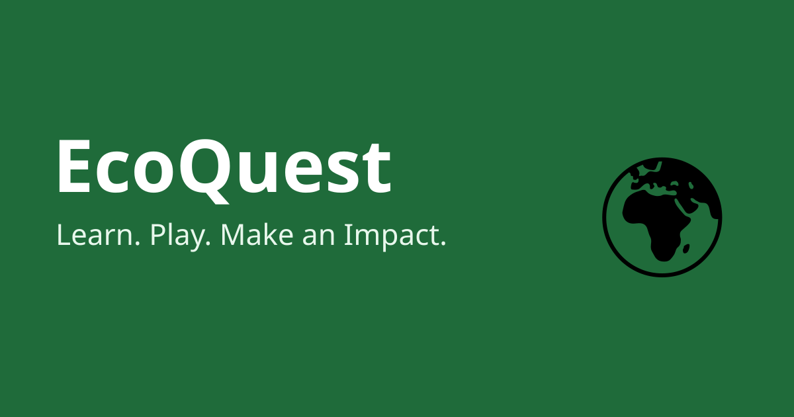

<p align="center"></p>

# EcoQuest — Gamified Environmental Learning

**Learn. Play. Make an Impact.** Lessons, quizzes, challenges, XP, levels, badges, streaks and a leaderboard about sustainability.



## What is in this repo

| Part | Location | Status |
|---|---|---|
| Frontend (vanilla HTML/CSS/JS, hash router) | `public/` | Working. Stores progress in `localStorage`. |
| Backend API (Express + SQLite, JWT auth) | `server/` | Working API. **Not yet wired to the frontend.** |
| Docs | `docs/` | Analysis and architecture notes |

Honest status: the UI runs standalone and saves progress in the browser only. The API is a separate, tested-for-syntax service that implements real accounts and server-side reward validation. Connecting the two is listed under *Roadmap*.

## Features
- 6 topics with a lesson, a quiz (3 questions each) and explanations; 6 challenges; 8 badges
- XP, levels (`floor(XP / 500) + 1`), daily streaks, one-time XP per activity (no farming)
- Dark mode (persisted), keyboard-friendly, ARIA progress bars, reduced-motion support
- Leaderboard with clearly labelled fictional demo users (frontend) or real users (API)

## Run the frontend only
Open `public/index.html` in a browser, or serve it: `npx serve public`.

## Run frontend + API
```bash
npm install
cp .env.example .env      # then set JWT_SECRET to a long random value
npm start                 # http://localhost:3000
```
Requires Node 18+. The server serves `public/` and the API under `/api`.

## API
| Method | Path | Auth | Purpose |
|---|---|---|---|
| POST | `/api/register` | – | `{username, password}` → `{token}` |
| POST | `/api/login` | – | `{username, password}` → `{token}` |
| GET | `/api/me` | Bearer | Profile, progress, badges |
| POST | `/api/complete` | Bearer | `{kind:'lesson'\|'quiz'\|'challenge', item, answers?}` → XP gained, badges |
| GET | `/api/leaderboard?page=1` | – | Public fields only, 20 per page |

Security: bcrypt hashing, JWT (7 days), rate limiting, input validation, parameterised SQL, quiz scoring and XP computed on the server, XP paid once per item.

## Project structure
```
public/  index.html, css/styles.css, js/app.js, images/
server/  index.js, content.json (answer key)
docs/    ANALYSIS.md, ARCHITECTURE.md
```

## Roadmap
1. Replace the username dialog with register/login forms calling the API; send quiz answers to `/api/complete`
2. Move lesson/quiz content to the database and add an admin area
3. Search/filters, weekly/monthly leaderboard, charts
4. Automated tests (XP, levels, streaks, scoring), CI, deployment
5. Source citations for any factual statistics

## Content note
Lessons are short general-education summaries without statistics or invented organisations. Have an expert review before publishing widely.

## License
MIT — see `LICENSE`.
